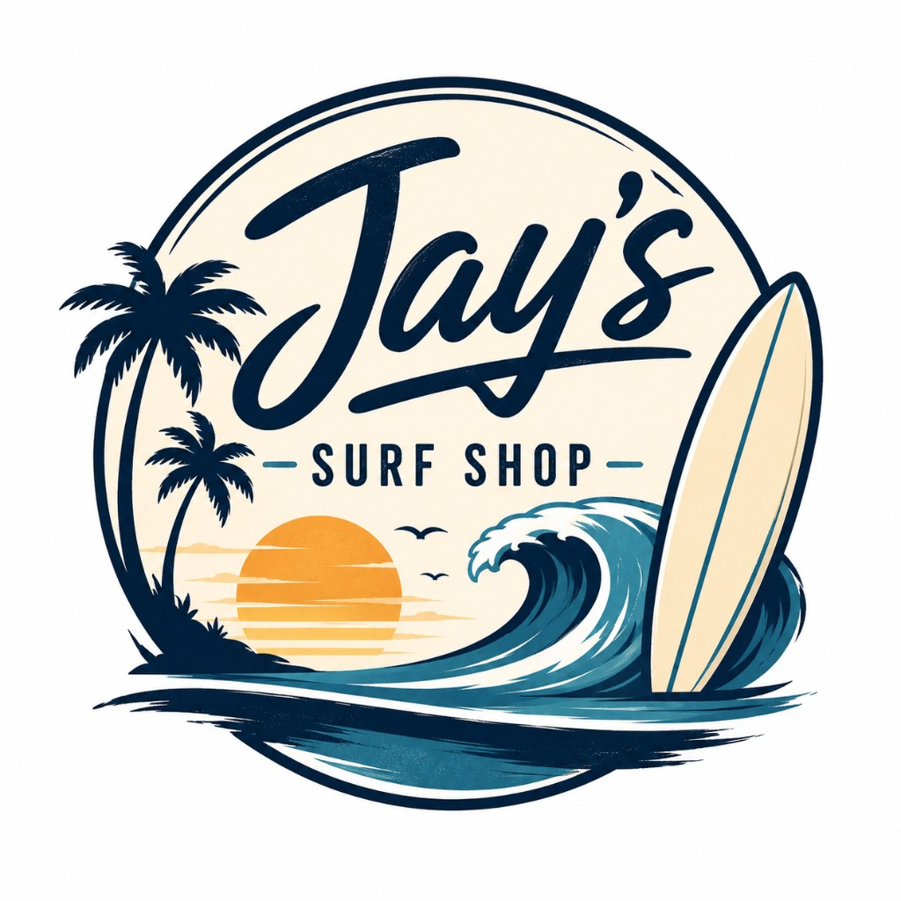

<h1 align="center">Jay's Surf Shop — GCP</h1>

<p align="center">
  
</p>

<p align="center">
  GCP twin of <a href="https://github.com/AstralJays/JaysSurfShop">JaysSurfShop</a> — same open-source <strong>POC / demo</strong> app.
  Fork or clone, deploy on <strong>GKE</strong> or <strong>Cloud Run</strong>, connect <strong>your</strong> security tooling, and run the built-in attacks from <code>/security</code>.
</p>

<p align="center">
  <a href="https://github.com/AstralJays/JaysSurfShop-GCP">github.com/AstralJays/JaysSurfShop-GCP</a>
</p>

> [!CAUTION]
> **Do not deploy to production accounts.**

## Architecture

```
Internet → frontend (GKE LoadBalancer or Cloud Run)
              ├── chat-rag (RAG + Vertex Gemini / OpenAI fallback)
              └── board-generator (OpenAI images by default; optional Vertex Imagen)

Internet → order-webhook (serverless — EICAR + PyYAML CVE-2020-14343)
              ↑ checkout from cart
```

| Service | Stack | Port / entry |
|---------|-------|--------------|
| **frontend** | Next.js 15, React, Tailwind | 3000 |
| **chat-rag** | FastAPI, ChromaDB, Vertex Gemini (default) or OpenAI | 8001 |
| **board-generator** | FastAPI, OpenAI images (default) or Vertex Imagen | 8002 |
| **order-webhook** | Python serverless (Cloud Function Gen2) | `/checkout`, `/demo/*` |

### Integrating security tooling

This repo is tool-agnostic. After deploy (or local Compose), point your CSPM / runtime / XDR / SCA product at the project and use `/security` to generate live attack signals (process, network, identity, packages, CVEs).

GKE vs Cloud Run differ as hosts (node sensor vs container-only runtime) — match your agent/instrumentation to the platform you choose. See [infrastructure/gke/README.md](infrastructure/gke/README.md) and [infrastructure/cloud-run/README.md](infrastructure/cloud-run/README.md).

## Quick start (local)

Same modernized shop as the AWS repo (Maya, login, orders, DVWA-style `/security` map) —
with **Vertex Gemini** for chat and **GCP** cloud PoCs (metadata, SA impersonation, GCS).

```bash
cp .env.example .env
# Local default is OpenAI — set OPENAI_API_KEY
# On GKE/Cloud Run, LLM_PROVIDER=vertex uses Gemini + text-embedding-004 (no OpenAI key)

docker compose up --build
```

Open [http://localhost:3000](http://localhost:3000) · exploit lab at [/security](http://localhost:3000/security)

Vulnerabilities are on by default (Pillow CVE, exploit endpoints, path traversal, chat-rag on 8001). Point your tooling at the stack, then run attacks from the lab. On GCP: public GCS bucket export, overprivileged service accounts, open SSH firewall rule, and anonymous Cloud Function routes (EICAR + PyYAML CVE).

## Deploy to GCP

Choose **Cloud Run** or **GKE** — both share VPC, Artifact Registry, Secret Manager, Cloud Storage, Cloud Function, and GitHub Workload Identity via `infrastructure/modules/workshop/`.

```bash
# 1. CI bootstrap (Artifact Registry + GitHub WIF)
./infrastructure/scripts/apply-ci.sh cloud-run   # or: gke

# 2. Add GitHub secrets (printed by apply-ci.sh):
#    GCP_PROJECT_ID, GCP_REGION, GCP_WORKLOAD_IDENTITY_PROVIDER,
#    GCP_DEPLOY_SERVICE_ACCOUNT, GCP_ARTIFACT_REGISTRY_HOST

# 3. Run "Build and Push Images" in Actions (builds all four images for GKE + Cloud Run)

# 4. Full stack — set image_tag in terraform.tfvars to the commit SHA from CI, or latest
cp infrastructure/cloud-run/terraform/terraform.tfvars.example \
   infrastructure/cloud-run/terraform/terraform.tfvars
# Set project_id in terraform.tfvars (openai_api_key optional when using Vertex)
./infrastructure/scripts/deploy-cloud-run.sh   # or: deploy-gke.sh
```

See [infrastructure/gke/README.md](infrastructure/gke/README.md) and [infrastructure/cloud-run/README.md](infrastructure/cloud-run/README.md).

The workflow [`.github/workflows/build-push.yml`](.github/workflows/build-push.yml) builds **frontend**, **chat-rag**, **board-generator**, and **order-webhook**, then pushes to Artifact Registry on push to `main` (or manual dispatch). GKE and Cloud Run both consume these images.

Workshop runbook: **[docs/WORKSHOP.md](docs/WORKSHOP.md)**

## Multi-cloud repos

| Cloud | Repo | Compute options |
|-------|------|-----------------|
| AWS | [JaysSurfShop](https://github.com/AstralJays/JaysSurfShop) | ECS Fargate, EKS |
| Azure | [JaysSurfShop-Azure](https://github.com/AstralJays/JaysSurfShop-Azure) | Container Apps, AKS |
| GCP | **JaysSurfShop-GCP** | Cloud Run, GKE |

## Project structure

```
JaysSurfShop-GCP/
├── docs/WORKSHOP.md
├── infrastructure/
│   ├── modules/workshop/        # VPC, Artifact Registry, Secret Manager, GCS, Function, GitHub WIF
│   ├── gke/terraform/           # GKE + Kubernetes workloads
│   ├── cloud-run/terraform/
│   ├── function/order-webhook/  # checkout Function (EICAR + PyYAML CVE)
│   └── scripts/                 # apply-ci, deploy-gke/cloud-run, build-push
├── frontend/
├── services/
└── docker-compose.yml
```

## License

MIT
